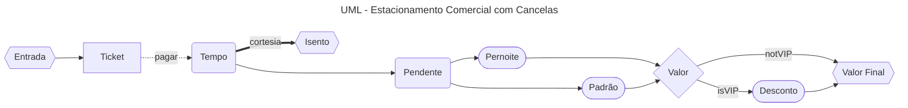

# veri-val-t1
Repo Trabalho 1 de Verificação e Validação de Software

### Enunciado
Definir e implementar, usando Java e JUnit, um conjunto de casos de teste (com base nas técnicas baseadas em especificação por particionamento e valor limite) que permita aceitar ou rejeitar as classes entregues.

### Problema 

Estamos interessados em um sistema de informação para o controle do estacionamento pago 
de centros comerciais cujo funcionamento se baseia em cancelas. 
O exercício consiste na modelagem e implementação da classe responsável pelo cálculo do 
valor a ser pago pelo ticket de estacionamento. 
O estacionamento do centro comercial abre as 08:00 da manhã e fecha às 02:00 da manhã do 
dia seguinte.

Com base na data (dia, mês e ano) e horário (hora e minuto) de entrada e saída informados e 
se o automóvel é cliente VIP, o cálculo do valor a ser pago pelo estacionamento segue as 
seguintes regras: 

• Cliente VIP tem 50% de desconto sobre o valor final da tarifa. 

• Todo cliente tem 15 minutos de cortesia, ou seja, o valor a ser pago é zero. 

• Até 1 hora (inclusive) de permanência, o valor é fixo, sendo atualmente de R$5,90. 

• Acima de 1 hora e que não seja pernoite, o valor é incrementado de R$2,50 a cada 
intervalo de 1 hora. 

• Caso o veículo saia após as 08:00 da manhã de dias posteriores, a tarifa é convertida 
para pernoite, cujo valor atual é de R$50,00 por pernoite. 